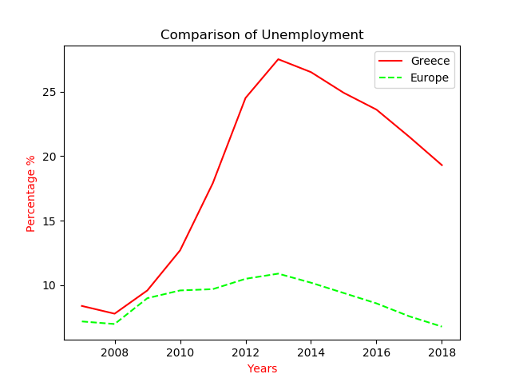

[Back](../libraries.md)

# Matplotlib
---

#### What is Matplotlib?
Matplotlib is one of the most popular Python packages used for data visualization. It is a cross-platform library for making 2D plots from data in arrays. It provides an object-oriented API that helps in embedding plots in applications using Python GUI toolkits such as PyQt, WxPythonotTkinter. It can be used in Python and IPython shells, Jupyter notebook and web application servers also.
Matplotlib is often used along with package  like [NumPy](numpy.md)

#### Install Matplotlib 
```python
pip install matplotlib
```

#### Import Matplotlib
```python
import matplotlib.pyplot as plt
```

#### Create Title
```python
plt.title("Name")
```

#### Create X and Y Labels
```python
plt.xlabel('Name')
plt.ylabel('Name')
```
```python
plt.xlabel('Name', color='red')
plt.ylabel('Name', color='#ff0000')
```

#### Create Plot
```python
plt.plot()
```
```python
plt.plot(name_x, name_y)
```
```python
plt.plot(name_x, name_y, color='#ff0000')
```
```python
plt.plot(name_x, name_y, color='#ff0000', linestyle='--')
```
```python
plt.plot(name_x, name_y, color='#ff0000', linestyle='--', label="Name")
```

#### Add Labels in Plot
```python
plt.legend()
```

#### Show Plot
```python
plt.show()
```

#### Save Plot In Image
```python
plt.savefig('name.png')
```
```python
plt.savefig('name.png', transparent = True) # Transparent Figure
```

#### Close And Clear
```python
plt.cla() # Clear an axis
plt.clf() # Clear the entire figure
plt.close() # Close a window
```

#### Examples:

##### Example 1:
```python
import matplotlib.pyplot as plt

years_x = [2007,2008,2009,2010,2011,2012,2013,2014,2015,2016,2017,2018]
greece_y = [8.4,7.8,9.6,12.7,17.9,24.5,27.5,26.5,24.9,23.6,21.5,19.3]
europe_y = [7.2,7,9,9.6,9.7,10.5,10.9,10.2,9.4,8.6,7.6,6.8]

plt.title("Comparison of Unemployment")

plt.plot(years_x, greece_y, color='#ff0000', label="Greece")
plt.plot(years_x, europe_y, color='#00ff00', label="Europe", linestyle='--')

plt.xlabel('Years', color='#ff0000')
plt.ylabel('Percentage %', color='#ff0000')

plt.savefig('plot.png')

plt.legend()
plt.show()
```
##### Result 1:

```python

```